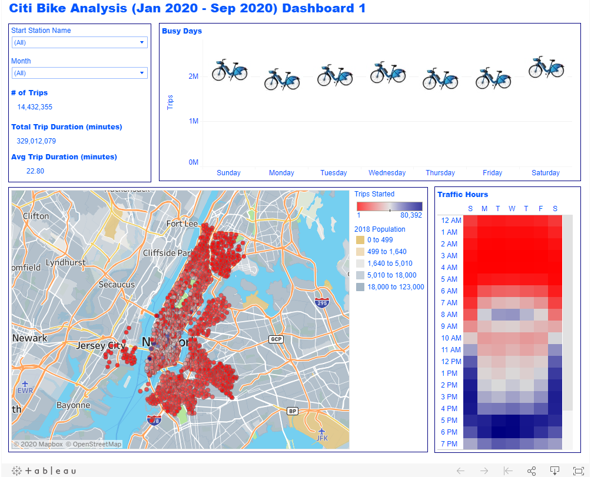
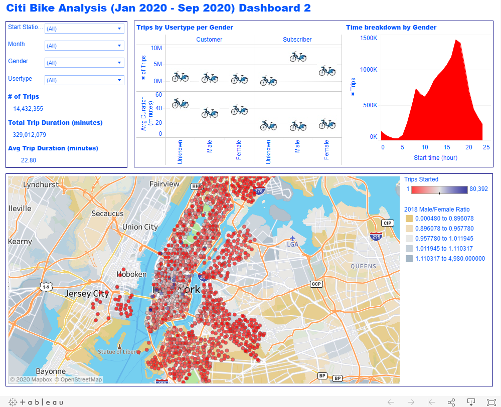

# Tableau-challenge
Visualizing New York Citi Bike data in Tableau

#### -- Project Status: [Completed]
#### -- Project link: https://public.tableau.com/profile/nabeel.sheikh6206#!/vizhome/NYC_16043683651930/Dashboard1

## Project Objective
The purpose of this project is to analyze the New York City Bike Program, the largest bike sharing program in the United States, for trends that will answer the following questions and help improve the program:

* How many trips have been recorded total during the chosen period?

* What are the peak hours in which bikes are used during summer months?

* What are the peak hours in which bikes are used during winter months?

* What is the gender breakdown of active participants (Male v. Female)?

* How effective has gender outreach been in increasing female ridership over the timespan? 

* What are the top 10 stations in the city for starting a journey?

* What are the top 10 stations in the city for ending a journey?

* What are the bottom 10 stations in the city for starting a journey?

* What are the bottom 10 stations in the city for ending a journey?

### Methods Used
* Data Visualization

### Technologies
* Tableau

## Process
The logic behind the project was to utilize the massive data set provided by New York Citi Bike Program. Each month, the bike data is collected, organized and made public on the [Citi Bike Data](https://www.citibikenyc.com/system-data) webpage. However, for the purpose of this project only data dating backing to January 2020 through September 2020 is analyzed.

Once the data was extracted into Tableau, data for each month was joined together in a single data source. Thereafter, it was possible to use Tableau to create visualizations.

### Analysis
It appears in 2020 thus far, there have been at least two phenomenons observed: bike usage variability and gender gap.

To analyze the first phenomenon, let's start with Dashboard 1.

The interactive dashboard allows the user to filter by starting station name and month of the year for detailed analysis in each of the views. For the full data set, it can be seen that there were over 14 million trips recorded. Examining the entirety of the data, one observable trend is the higher usage over the weekend, while the lowest on Monday. Which makes sense as most people enjoy their weekends and then return to work on Monday. Furthermore, in the heatmap it can be seen which hours in particular are the peak hours. The weekends show a larger range from 11am to 7pm, as expected. However, within the weekdays too it appears 4pm to 7pm are the traffic hours. On the map, it is possible to see the location of all the stations and distinguish the popular started locations by the blue hue. 

All these views show the best time to perform any necessary repairs or maintenance work. Moreover, the map clearly illustrates which stations are more popular than others and it may be possible to move bikes from less popular stations to more popular stations to efficiently utilize all the bikes.

Moving onto the next phenomena, let's take a look at Dashboard 2.

In this interactive dashboard there are additional filters for the user to explore, gender and usertype. Breaking down the trips by usertype and gender, clearly shows that subscribers make up a large number of the trips, however customers tend to make longer trips. This makes sense because subscribers are every day commuters who probably commute to work only during the weekdays, whereas customers are most likely travelers who like to explore the city. However, it must be noted that within subscribers the gap between the number of trips made by each gender is large. Female subscribers make less trips than male subscribers. Therefore something must be done to attract more female riders. Looking over to the time breakdown, there is no difference between the usertype or genders. The popular time is between 4pm and 7pm, as concluded by previous phenomena analysis. The map shows an overlay of 2018 Male/Female Ratio data from the Census. It can be seen that majority of the stations exist in areas that are pretty balanced, so it really comes down to marketing and appealing the female riders. It may be possible to move the less popular stations to higher female population areas as well.
